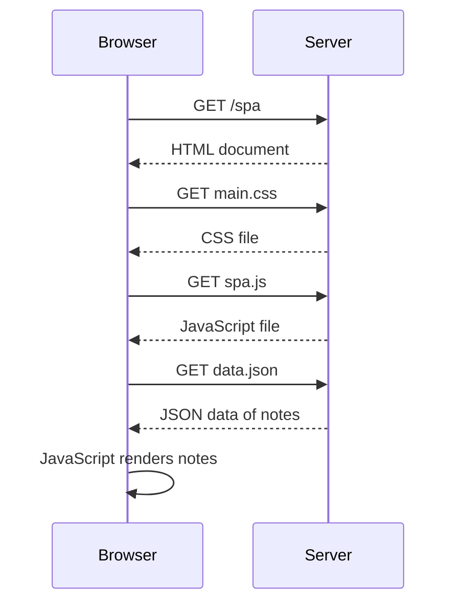

# Exercise 0.5 – Single Page Application Diagram

This diagram describes what happens when the user opens the Single Page Application version of the notes app.

```mermaid
sequenceDiagram
    participant Browser
    participant Server

    Browser->>Server: GET /spa
    Server-->>Browser: HTML document

    Browser->>Server: GET main.css
    Server-->>Browser: CSS file

    Browser->>Server: GET spa.js
    Server-->>Browser: JavaScript file

    Browser->>Server: GET data.json
    Server-->>Browser: JSON data of notes

    Browser->>Browser: JavaScript renders notes
```