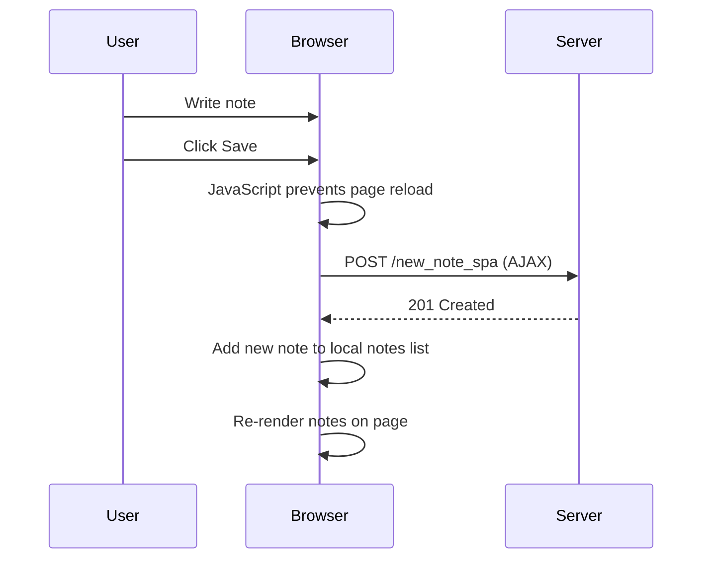

# Exercise 0.6 – New Note in SPA Diagram

This diagram describes what happens when a user creates a new note in the SPA version of the application.

```mermaid
sequenceDiagram
    participant User
    participant Browser
    participant Server

    User->>Browser: Write note
    User->>Browser: Click Save

    Browser->>Browser: JavaScript prevents page reload

    Browser->>Server: POST /new_note_spa (AJAX)

    Server-->>Browser: 201 Created

    Browser->>Browser: Add new note to local notes list
    Browser->>Browser: Re-render notes on page
```
